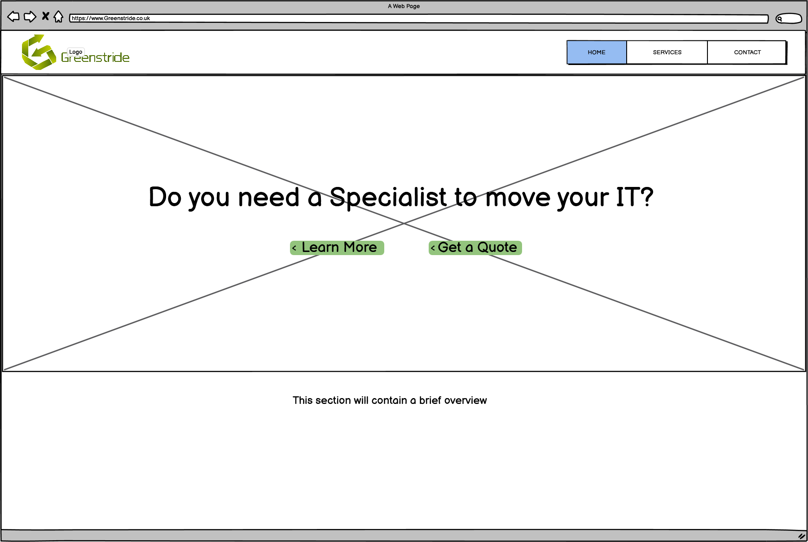
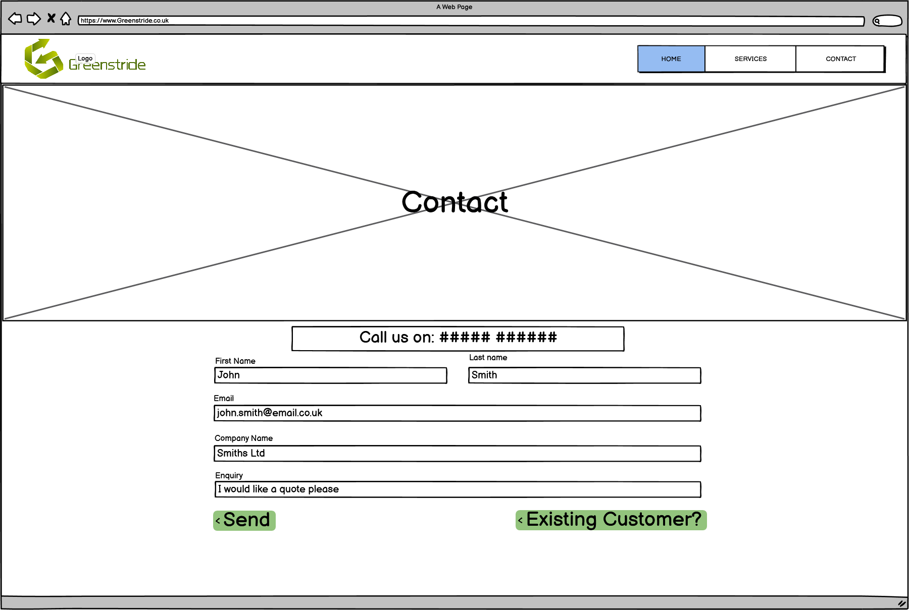

# Greenstride (UX Design for User-Centric Front End Milestone Project)

For this project, I have decided to develop a website for the IT relocation company greenstride. The overall goal of the project will be to create an attractive and intuitive website to increase traffic and inquiries. The website must contain at least 3 pages of custom HTML5 and a supporting CSS3 style document. There must be a navbar and a supporting README.md file.

Greenstride are specialists in IT relocation, installation, and recycling, based in the southwest of the UK and South Wales. 

# Table of Contents
1. [UX](#UX)
2. [Features](#features)
3. [JQuery](#jq)
4. [Testing](#testing)
5. [Deployment](#deployment)
6. [Credits](#credits)
7. <a href="https://jmortifee.github.io/user-centric-front-end/" target="_blank">Site</a>

## UX 

Greenstried's website will be viewed by potential customers who are both knowledgable, and completely new to the services Greenstride provides. To ensure both parties, and all of those in between, have a positive emotional reaction to the site, the information must be informative without being jargon-filled. Images will be placed in each section to inform the user, at a glance what the section is about.

### User Stories

Below are four user stories that have been extrapolated out of 2 epics:

#### Epic 1: Users want to be able to view the services that Greenstride provides so that they can determine if they are the services the user requires. The user can then learn more about these services in more detail and get in contact if they want a quote.

__User story 1:__ The user wants to see the services Greenstride provide and how they go about these services.

__Solution to user story 1:__ When the user loads the website the home page will contain a brief overview of the company, there will also be a button for the user to click to get to the services page to learn more about the company.

Format: 

__User story 2:__ Once the user has read through the information about the service they would like to use they need to be able to get in contact.

__Solution for user story 2:__  At the end of each services section an embedded link in some text will guide them to the contact page.

Format: 

#### Epic 2: Existing customers or users who have been recommended Greenstride, want to be able to get a quote quickly.

__User story 3:__ The user knows or has learnt of the services and would immediately like to get in contact.

__Solution for user story 3:__  Next to the learn more button there will be a quick quote/ contact button that will take you directly to the contact page where there will be phone information and a contact form.

Format: 

__user story 4:__ The User is an existing customer and would like to see what their company has used Greestride for in the past.

__Solution to user story 4:__ A login section will allow users to see their previous invoices and transactions.

Format: 

## Features 
In this section, you should go over the different parts of your project, and describe each in a sentence or so.

### Existing Features

Feature 1 - allows users X to achieve Y, by having them fill out Z
...
For some/all of your features, you may choose to reference the specific project files that implement them, although this is entirely optional.

In addition, you may also use this section to discuss plans for additional features to be implemented in the future:

### Features Left to Implement

Another feature idea
Technologies Used
In this section, you should mention all of the languages, frameworks, libraries, and any other tools that you have used to construct this project. For each, provide its name, a link to its official site and a short sentence of why it was used.

## JQuery 
The project uses JQuery to simplify DOM manipulation.

## Testing 

In this section, you need to convince the assessor that you have conducted enough testing to legitimately believe that the site works well. Essentially, in this part you will want to go over all of your user stories from the UX section and ensure that they all work as intended, with the project providing an easy and straightforward way for the users to achieve their goals.

Whenever it is feasible, prefer to automate your tests, and if you've done so, provide a brief explanation of your approach, link to the test file(s) and explain how to run them.

For any scenarios that have not been automated, test the user stories manually and provide as much detail as is relevant. A particularly useful form for describing your testing process is via scenarios, such as:

### Contact form:
Go to the "Contact Us" page
Try to submit the empty form and verify that an error message about the required fields appears
Try to submit the form with an invalid email address and verify that a relevant error message appears
Try to submit the form with all inputs valid and verify that a success message appears.

In addition, you should mention in this section how your project looks and works on different browsers and screen sizes.

You should also mention in this section any interesting bugs or problems you discovered during your testing, even if you haven't addressed them yet.

If this section grows too long, you may want to split it off into a separate file and link to it from here.

## Deployment 

This section should describe the process you went through to deploy the project to a hosting platform (e.g. GitHub Pages or Heroku).

In particular, you should provide all details of the differences between the deployed version and the development version, if any, including:

Different values for environment variables (Heroku Config Vars)?
Different configuration files?
Separate git branch?
In addition, if it is not obvious, you should also describe how to run your code locally.

## Credits 
Content
The text for section Y was copied from the Wikipedia article Z
Media
The photos used in this site were obtained from ...
Acknowledgements
I received inspiration for this project from X

Click <a href="https://jmortifee.github.io/user-centric-front-end/" target="_blank">here</a> to view the site.
